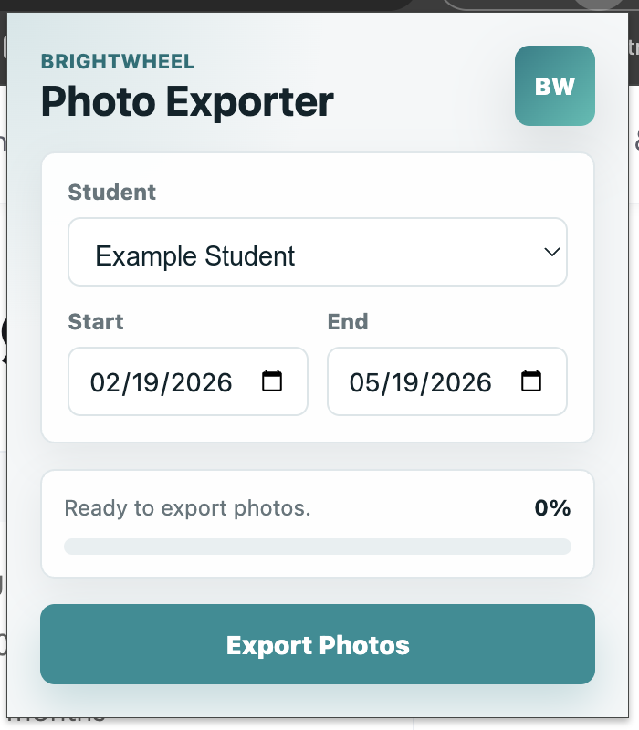

# Brightwheel Photo Exporter

An unofficial Chrome extension for downloading Brightwheel student photos as a ZIP file.

This extension is not available in the Chrome Web Store. Install it as an unpacked Chrome extension from this folder.

## Install

1. Download or clone this project to your computer.
2. Open Chrome and go to `chrome://extensions`.
3. Turn on **Developer mode**.
4. Click **Load unpacked**.
5. Select this project folder, the folder that contains `manifest.json`.
6. Pin the extension from Chrome's extensions menu if you want quick access.

Chrome's official unpacked extension instructions are here: [Load an unpacked extension](https://developer.chrome.com/docs/extensions/get-started/tutorial/hello-world#load-unpacked).

## Use

1. Sign in to Brightwheel in Chrome.
2. Open the Brightwheel page for your child or classroom.
3. Click the Brightwheel Photo Exporter extension icon.
4. Select the student and date range.
5. Click **Export Photos**.
6. Wait for the ZIP file download to finish.

The progress bar shows page scanning, photo downloads, ZIP creation, and completion. Date ranges over 90 days are allowed, but the extension will show a warning because large exports may take longer.

## Notes

- This extension runs locally in your browser.
- It uses your active Brightwheel session; it does not ask for or store your password.
- If you navigate away from Brightwheel, reopen a Brightwheel page before using the exporter again.
- Because this is an unpacked extension, Chrome will not update it automatically from the Chrome Web Store.

## Troubleshooting

If the exporter cannot load:

1. Make sure you are signed in to Brightwheel.
2. Make sure the active tab is a Brightwheel page.
3. Close and reopen the extension popup.
4. In `chrome://extensions`, click the reload button for the extension if you recently changed files.
